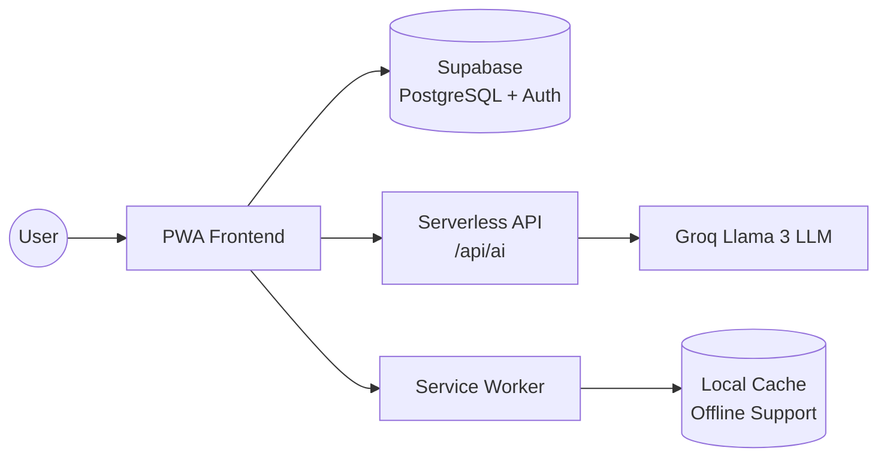

## Overview

Estudio Three is a Progressive Web Application (PWA) designed for student-athletes who need to balance demanding academic schedules with intensive physical training. The architecture prioritizes offline functionality, real-time AI assistance, and intelligent routine optimization.

## High-Level Architecture



## Technology Stack

| Component | Technology | Purpose |
|-----------|-----------|----------|
| **Frontend** | React 19 + TypeScript | Component architecture with type safety |
| **Build Tool** | Vite | Lightning-fast HMR and optimized builds |
| **State Management** | Zustand | Lightweight, modular store architecture |
| **Styling** | Tailwind CSS 3.0 | Atomic, responsive design system |
| **Backend** | Supabase | PostgreSQL + Auth + Row Level Security |
| **AI Engine** | Groq (Llama 3) | Ultra-fast, open-source LLM inference |
| **AI Proxy** | Vercel Serverless | Secure API key protection |
| **PWA** | Vite PWA Plugin | Offline support, auto-updates, installable |
| **Testing** | Vitest | Fast unit testing framework |
| **i18n** | i18next | Multi-language support (ES, EN, FR, IT) |

## Architecture Decision Records (ADRs)

### Zustand vs Redux

**Decision:** Zustand

**Rationale:**
- Application consists of highly divisible stores (Settings, Auth, Routine, Pomodoro, Tasks, etc.)
- Zustand provides modularization without Redux boilerplate
- Native `persist` middleware integration is intuitive
- Simpler learning curve for contributors

### Groq vs OpenAI

**Decision:** Groq with Llama 3

**Rationale:**
- Zero cost for development and production
- Open-source model (Llama 3)
- Dramatically lower latency on LPU infrastructure
- Critical for instant AI Coach responses
- No vendor lock-in

### Supabase vs Firebase

**Decision:** Supabase

**Rationale:**
- Real PostgreSQL relational database (not NoSQL)
- Maintains data integrity for complex academic/routine management
- Powerful Row Level Security (RLS) for multi-tenant isolation
- SQL-based queries are more maintainable
- Open-source alternative to Firebase

### Vite vs Create React App / Next.js

**Decision:** Vite

**Rationale:**
- Create React App is architecturally obsolete
- Next.js is too heavyweight and forces SSR
- Application is private (behind authentication), no SEO needed
- Vite provides instant Hot Module Reload
- Native PWA plugin integration is seamless
- Faster build times and smaller bundle sizes

### Serverless Proxy for AI

**Decision:** Vercel Serverless Functions (`/api/ai`)

**Rationale:**
- `GROQ_API_KEY` never reaches client bundle
- Prevents API key theft via reverse engineering
- Built-in rate limiting by IP
- Zero infrastructure management
- Automatic scaling

## State Management Architecture

Estudio Three uses **14+ specialized Zustand stores** for modular state management:

```mermaid
graph TD
    subgraph "🧠 Zustand Stores"
        AppStore[useAppStore<br/>Profile + Routine]
        AuthStore[useAuthStore<br/>Session + Auth]
        SettingsStore[useSettingsStore<br/>Theme + Language + Timer]
        TaskStore[useTaskStore<br/>Tasks + Subtasks]
        CalendarStore[useCalendarStore<br/>Events + Schedule]
        GoalsStore[useGoalsStore<br/>Goals + Progress]
        AcademicsStore[useAcademicsStore<br/>Subjects + Grades]
        HabitsStore[useHabitsStore<br/>Habits + Streaks]
        AchievementsStore[useAchievementsStore<br/>Achievements + XP]
        PomodoroStore[usePomodoroStore<br/>Timer + Sessions]
        ResourcesStore[useResourcesStore<br/>Study Materials]
        ChatStore[useChatStore<br/>AI Conversation]
        ZenStore[useZenMode<br/>Focus Mode]
        ToastStore[toastStore<br/>Notifications]
    end

    subgraph "☁️ Supabase"
        DB[(PostgreSQL + RLS)]
    end

    subgraph "🤖 AI"
        Proxy[/api/ai Proxy]
        Groq[Groq LLM]
    end

    TaskStore --> DB
    CalendarStore --> DB
    GoalsStore --> DB
    AcademicsStore --> DB
    HabitsStore --> DB
    AchievementsStore --> DB
    ResourcesStore --> DB
    AuthStore --> DB

    ChatStore --> Proxy
    Proxy --> Groq

    AppStore -.->|generates| PomodoroStore
    AchievementsStore -.->|triggers| TaskStore
    AchievementsStore -.->|triggers| HabitsStore

    SettingsStore -.->|persists| LocalStorage[(localStorage)]
    AppStore -.->|persists| LocalStorage
    PomodoroStore -.->|persists| LocalStorage
    ZenStore -.->|persists| LocalStorage
```

### Store Responsibilities

<Accordion title="useAppStore - Core Application State">
**Purpose:** Central hub for user profile and routine generation

**Key State:**
- User profile (sleep schedule, class schedule, subjects, training)
- Current routine blocks
- Daily feedback
- Onboarding status

**Key Actions:**
- `generateRoutine()` - Triggers routine solver algorithm
- `updateProfile()` - Syncs profile changes to Supabase
- `skipBlock()` / `completeBlock()` - Routine interactions
</Accordion>

<Accordion title="useAuthStore - Authentication">
**Purpose:** Manages Supabase authentication state

**Key State:**
- Current user session
- Loading states
- Error messages

**Key Actions:**
- `signIn()` / `signUp()` / `signOut()`
- `resetPassword()`
- Auto-refresh token handling
</Accordion>

<Accordion title="usePomodoroStore - Focus Timer">
**Purpose:** Pomodoro timer with task tracking and history

**Key State:**
- Timer mode (focus, short break, long break)
- Remaining time
- Active task reference
- Session history

**Key Actions:**
- `startTimer()` / `pauseTimer()` / `resetTimer()`
- `completeSession()` - Saves to `focus_sessions` table
- `incrementPomodoro()` - Updates task pomodoro count
</Accordion>

<Accordion title="useTaskStore - Task Management">
**Purpose:** Full CRUD for tasks and subtasks

**Key State:**
- Tasks array (with filters)
- Subtasks by task ID
- Loading/error states

**Key Actions:**
- `fetchTasks()` - Loads from Supabase
- `createTask()` / `updateTask()` / `deleteTask()`
- `toggleSubtask()` - Marks subtask complete
- `setPriority()` / `setStatus()` - Quick updates
</Accordion>

## Routine Solver Algorithm

The core differentiator of Estudio Three is its **intelligent routine generation engine** located in `src/features/routine/engine/solver.ts`.

### Algorithm Overview

```typescript
// Simplified pseudocode
function generateDailyRoutine(profile: UserProfile, date: Date): RoutineBlock[] {
  // 1. Create fixed blocks (school, training, sleep)
  const fixedBlocks = createFixedBlocks(profile, date);
  
  // 2. Find free time slots between fixed blocks
  const freeSlots = findFreeSlots(fixedBlocks, wakeTime, bedTime);
  
  // 3. Create prioritized task queue
  const taskQueue = createTaskQueue(profile.subjects);
  
  // 4. Allocate tasks to slots with energy budgeting
  const MAX_DAILY_LOAD = 5500;
  let currentLoad = calculateInitialLoad(fixedBlocks);
  
  while (taskQueue.length > 0 && currentLoad < MAX_DAILY_LOAD) {
    const task = taskQueue.shift();
    
    // Check if task fits energy budget
    if (currentLoad + task.energyCost > MAX_DAILY_LOAD) {
      // Reduce task duration to fit budget
      task.duration = calculateMaxDuration(remainingEnergy, task);
    }
    
    // First-fit allocation with fragmentation support
    for (const slot of freeSlots) {
      if (slot.duration >= task.duration) {
        // Task fits completely
        allocateTaskToSlot(task, slot);
        currentLoad += task.energyCost;
        break;
      } else {
        // Fragment task across multiple slots
        allocateFragment(task, slot);
        taskQueue.unshift(remainingTask); // Re-queue remainder
      }
    }
  }
  
  return sortedBlocks;
}
```

### Energy Cost System

```typescript
const ENERGY_COSTS = {
  SCHOOL: 7,                // Regular classes
  STUDY_SECONDARY: 9,       // Light training/study
  STUDY_PRINCIPAL: 9,       // Intensive study
  ACADEMIC_EVENT: 10,       // Exams, matches
  SLEEP: 0,                 // Recovery
  HABIT: 2,                 // Reading, meditation
  STUDY: 5,                 // Base study cost
  BREAK: 1                  // Short breaks
};
```

Each block's **total energy cost** = `duration (minutes) × energyCost`

### Heuristic Rules

1. **Fatigue Collision Avoidance**: Never schedule high-difficulty academic tasks (difficulty 5) immediately after high-intensity training

2. **Cognitive Load Cap**: Daily cognitive load cannot exceed `MAX_DAILY_LOAD = 5500`

3. **Task Fragmentation**: If a task doesn't fit in a single slot, split it into "Part 1" and "Part 2" across multiple slots

4. **Priority Scheduling**: Tasks are sorted by difficulty/priority (higher difficulty = higher priority)

5. **Minimum Viable Slots**: Slots smaller than 20 minutes are skipped

## Data Flow

```text
1. Onboarding (Initial Data Collection)
   ↓
2. Profile Saved (Zustand Local + Push to Supabase)
   ↓
3. Engine Core (Process constraints and fixed schedule)
   ↓
4. Routine Generation (Blocks with weighted energy costs)
   ↓
5. User Interaction (Skip tasks, complete pomodoros, get AI advice)
   ↓
6. Feedback Loop (Re-balance loads for future days)
```

## Security Architecture

### API Key Protection

- Groq API key stored only in Vercel environment variables
- Never exposed to client-side JavaScript
- Proxy endpoint: `POST /api/ai`
- Rate limiting by IP address

### Row Level Security (RLS)

Supabase enforces strict PostgreSQL RLS policies:

```sql
-- Example: Users can only read their own tasks
CREATE POLICY "Users manage their tasks" 
  ON tasks FOR ALL 
  USING (auth.uid() = user_id);
```

Key principles:
- Users cannot read/write data where `user_id ≠ auth.uid()`
- JWT tokens are validated on every database query
- No backend API layer needed—RLS handles authorization

### Authentication

- Supabase Auth (OAuth 2.0 + Magic Links)
- JWT tokens stored in `httpOnly` cookies
- Automatic token refresh
- No passwords stored in application code

## Performance Optimizations

### Code Splitting

```typescript
// vite.config.ts
manualChunks: {
  'vendor-react': ['react', 'react-dom'],
  'vendor-ui': ['lucide-react', 'date-fns', 'clsx'],
  'vendor-store': ['zustand']
}
```

Benefits:
- Parallel chunk downloads
- Smaller initial bundle
- Better browser caching

### Lazy Loading

```typescript
const Calendar = lazy(() => import('./features/calendar/CalendarPage'));
const Stats = lazy(() => import('./features/stats/StatsPage'));
```

Components load on-demand, reducing initial load time.

### PWA Caching

Service Worker strategies:
- **Static Assets**: `CacheFirst` (logos, icons, fonts)
- **API Calls**: `NetworkFirst` with offline fallback
- **Fonts**: `CacheFirst` with 365-day expiration

```typescript
// PWA runtime caching for Google Fonts
runtimeCaching: [
  {
    urlPattern: /^https:\/\/fonts\.googleapis\.com\/.*/i,
    handler: 'CacheFirst',
    options: {
      cacheName: 'google-fonts-cache',
      expiration: { maxAgeSeconds: 60 * 60 * 24 * 365 }
    }
  }
]
```

## Folder Structure

```
src/
├── components/        # Reusable UI components
│   ├── ui/           # Shadcn-style base components
│   └── layout/       # Layout wrappers
├── features/         # Feature-based modules
│   ├── routine/
│   │   └── engine/   # Routine solver algorithm
│   ├── calendar/
│   ├── tasks/
│   ├── pomodoro/
│   └── ai-coach/
├── stores/           # Zustand stores (14+ stores)
├── hooks/            # Custom React hooks
├── lib/              # Utility functions
├── types/            # TypeScript type definitions
└── i18n/             # Translation files (ES, EN, FR, IT)
```

## Build and Deployment

### Development

```bash
npm run dev          # Start dev server on localhost:5173
npm run test         # Run Vitest unit tests
npm run lint         # ESLint + TypeScript checks
```

### Production

```bash
npm run build        # Build optimized bundle
npm run preview      # Preview production build
```

### Docker Deployment

```dockerfile
FROM node:20-alpine
WORKDIR /app
COPY package*.json ./
RUN npm ci --only=production
COPY . .
RUN npm run build
EXPOSE 5173
CMD ["npm", "run", "preview"]
```

## Key Metrics

- **Bundle Size**: ~800KB (with code splitting)
- **Initial Load**: Less than 2 seconds on 3G
- **Lighthouse PWA Score**: 100/100
- **TypeScript Coverage**: 100% (strict mode)
- **Test Coverage**: Core engine >90%
