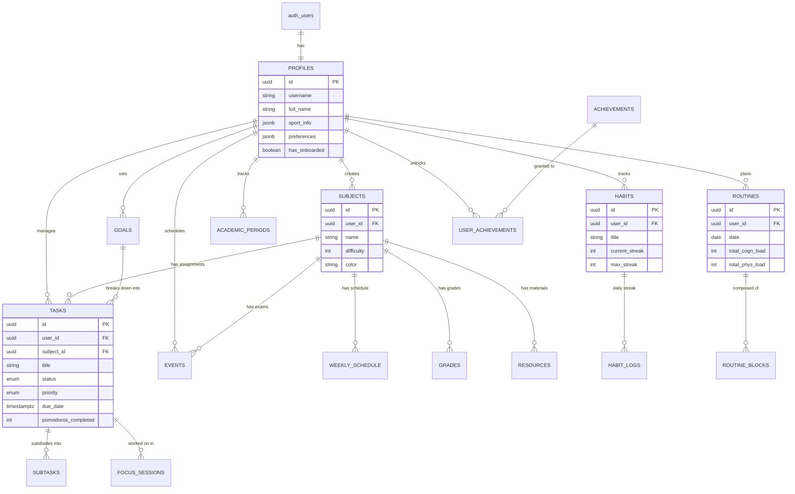

## Overview

Estudio Three uses **Supabase** (PostgreSQL 15+) as its primary database with a comprehensive relational schema designed for multi-dimensional student-athlete data management.

## Entity Relationship Diagram



## Custom Enums

PostgreSQL enums ensure type safety and data integrity:

```sql
-- Task management
CREATE TYPE task_status AS ENUM ('pending', 'in_progress', 'completed');
CREATE TYPE task_priority AS ENUM ('low', 'medium', 'high', 'urgent');

-- Focus sessions
CREATE TYPE session_mode AS ENUM ('focus', 'short_break', 'long_break');

-- Routine blocks
CREATE TYPE routine_block_type AS ENUM ('FIXED', 'FLEXIBLE', 'BUFFER');

-- Goals and events
CREATE TYPE goal_type AS ENUM ('academic', 'sport', 'personal', 'health');
CREATE TYPE event_type AS ENUM ('exam', 'match', 'training', 'class', 'other', 'holiday');

-- Weekly schedule
CREATE TYPE weekday AS ENUM ('monday', 'tuesday', 'wednesday', 'thursday', 'friday', 'saturday', 'sunday');
```

## Core Tables

### profiles

Extends Supabase Auth users with application-specific data.

```sql
CREATE TABLE profiles (
  id uuid REFERENCES auth.users NOT NULL PRIMARY KEY,
  updated_at timestamptz,
  username text UNIQUE,
  full_name text,
  avatar_url text,
  website text,
  
  -- Flexible JSON data
  sport_info jsonb DEFAULT '{}'::jsonb,  -- Sport-specific stats
  preferences jsonb DEFAULT '{}'::jsonb,  -- User preferences
  has_onboarded boolean DEFAULT false,
  
  CONSTRAINT username_length CHECK (char_length(username) >= 3)
);
```

**Key Fields:**
- `sport_info`: Stores sport-specific data (team, position, training intensity)
- `preferences`: UI preferences, notification settings, default views
- `has_onboarded`: Tracks if user completed initial setup

### subjects

Academic subjects with difficulty ratings (1-5).

```sql
CREATE TABLE subjects (
  id uuid DEFAULT gen_random_uuid() PRIMARY KEY,
  user_id uuid REFERENCES profiles(id) ON DELETE CASCADE NOT NULL,
  name text NOT NULL,
  difficulty int CHECK (difficulty BETWEEN 1 AND 5),
  color text,  -- Hex color for UI
  created_at timestamptz DEFAULT now()
);
```

**Difficulty Scale:**
- 1: Very Easy
- 2: Easy
- 3: Moderate
- 4: Hard
- 5: Very Hard (used by routine solver to prioritize study time)

### tasks

Powerful task management with Pomodoro tracking and recurrence.

```sql
CREATE TABLE tasks (
  id uuid DEFAULT gen_random_uuid() PRIMARY KEY,
  user_id uuid REFERENCES profiles(id) ON DELETE CASCADE NOT NULL,
  subject_id uuid REFERENCES subjects(id) ON DELETE SET NULL,
  goal_id uuid REFERENCES goals(id) ON DELETE SET NULL,
  
  title text NOT NULL,
  description text,
  status task_status DEFAULT 'pending',
  priority task_priority DEFAULT 'medium',
  due_date timestamptz,
  
  is_recurring boolean DEFAULT false,
  recurrence_pattern jsonb,  -- Stores cron-like pattern
  
  pomodoros_estimated int DEFAULT 0,
  pomodoros_completed int DEFAULT 0,
  
  created_at timestamptz DEFAULT now(),
  updated_at timestamptz DEFAULT now(),
  completed_at timestamptz
);

CREATE INDEX tasks_user_id_idx ON tasks(user_id);
CREATE INDEX tasks_status_idx ON tasks(status);
```

**Recurrence Pattern Example:**
```json
{
  "frequency": "weekly",
  "interval": 1,
  "days": ["monday", "wednesday", "friday"]
}
```

### subtasks

Checkbox-style subtasks for breaking down complex tasks.

```sql
CREATE TABLE subtasks (
  id uuid DEFAULT gen_random_uuid() PRIMARY KEY,
  task_id uuid REFERENCES tasks(id) ON DELETE CASCADE NOT NULL,
  title text NOT NULL,
  is_completed boolean DEFAULT false
);
```

### events

Calendar events (exams, matches, appointments).

```sql
CREATE TABLE events (
  id uuid DEFAULT gen_random_uuid() PRIMARY KEY,
  user_id uuid REFERENCES profiles(id) ON DELETE CASCADE NOT NULL,
  subject_id uuid REFERENCES subjects(id) ON DELETE SET NULL,
  
  title text NOT NULL,
  type event_type DEFAULT 'OTHER',
  description text,
  
  start_time timestamptz NOT NULL,
  end_time timestamptz,
  location text,
  
  is_all_day boolean DEFAULT false,
  created_at timestamptz DEFAULT now()
);

CREATE INDEX events_start_time_idx ON events(start_time);
```

### weekly_schedule

Recurring weekly commitments (classes, training sessions).

```sql
CREATE TABLE weekly_schedule (
  id uuid DEFAULT gen_random_uuid() PRIMARY KEY,
  user_id uuid REFERENCES profiles(id) ON DELETE CASCADE NOT NULL,
  subject_id uuid REFERENCES subjects(id) ON DELETE SET NULL,
  
  day_of_week int NOT NULL CHECK (day_of_week BETWEEN 0 AND 6),
  start_time time NOT NULL,
  end_time time NOT NULL,
  
  activity_type event_type DEFAULT 'CLASS',
  title text,
  location text,
  
  created_at timestamptz DEFAULT now()
);
```

**Day Mapping:** `0 = Sunday, 1 = Monday, ..., 6 = Saturday`

## Routine Engine Tables

### routines

Daily routine container with load metrics.

```sql
CREATE TABLE routines (
  id uuid DEFAULT gen_random_uuid() PRIMARY KEY,
  user_id uuid REFERENCES profiles(id) ON DELETE CASCADE NOT NULL,
  date date NOT NULL,
  
  total_cogn_load int DEFAULT 0,  -- Total cognitive load
  total_phys_load int DEFAULT 0,  -- Total physical load
  
  created_at timestamptz DEFAULT now(),
  UNIQUE(user_id, date)
);
```

### routine_blocks

Individual time blocks within a routine.

```sql
CREATE TABLE routine_blocks (
  id uuid DEFAULT gen_random_uuid() PRIMARY KEY,
  routine_id uuid REFERENCES routines(id) ON DELETE CASCADE NOT NULL,
  
  title text NOT NULL,
  description text,
  type routine_block_type DEFAULT 'FLEXIBLE',
  
  start_time time,
  duration int NOT NULL,  -- Minutes
  
  is_locked boolean DEFAULT false,
  is_completed boolean DEFAULT false,
  priority int DEFAULT 0,
  energy_cost int DEFAULT 0,
  
  task_id uuid REFERENCES tasks(id) ON DELETE SET NULL,
  event_id uuid REFERENCES events(id) ON DELETE SET NULL
);
```

**Block Types:**
- `FIXED`: Cannot be moved (school, training, sleep)
- `FLEXIBLE`: Can be rescheduled by solver
- `BUFFER`: Short breaks inserted by solver

## Focus and Productivity

### focus_sessions

Pomodoro timer history.

```sql
CREATE TABLE focus_sessions (
  id uuid DEFAULT gen_random_uuid() PRIMARY KEY,
  user_id uuid REFERENCES profiles(id) ON DELETE CASCADE NOT NULL,
  task_id uuid REFERENCES tasks(id) ON DELETE SET NULL,
  
  mode session_mode NOT NULL,
  duration int NOT NULL,  -- Seconds
  
  started_at timestamptz DEFAULT now(),
  completed_at timestamptz,
  was_completed boolean DEFAULT false
);

CREATE INDEX sessions_user_id_idx ON focus_sessions(user_id);
```

### daily_feedback

User-reported daily metrics.

```sql
CREATE TABLE daily_feedback (
  id uuid DEFAULT gen_random_uuid() PRIMARY KEY,
  user_id uuid REFERENCES profiles(id) ON DELETE CASCADE NOT NULL,
  date date NOT NULL,
  
  effort_rating int,  -- 1-5 scale
  water_intake int,   -- Glasses of water
  notes text,
  
  created_at timestamptz DEFAULT now(),
  UNIQUE(user_id, date)
);
```

## Academic Tracking

### grades

Grade tracking with weighted scores.

```sql
CREATE TABLE grades (
  id uuid DEFAULT gen_random_uuid() PRIMARY KEY,
  user_id uuid REFERENCES profiles(id) ON DELETE CASCADE NOT NULL,
  subject_id uuid REFERENCES subjects(id) ON DELETE CASCADE NOT NULL,
  
  score float NOT NULL,
  max_score float DEFAULT 10.0,
  weight float DEFAULT 1.0,  -- For weighted averages
  
  title text,  -- e.g., "Midterm Exam"
  date date DEFAULT CURRENT_DATE,
  notes text,
  
  created_at timestamptz DEFAULT now()
);
```

### academic_periods

Semesters, trimesters, or school years.

```sql
CREATE TABLE academic_periods (
  id uuid DEFAULT gen_random_uuid() PRIMARY KEY,
  user_id uuid REFERENCES profiles(id) ON DELETE CASCADE NOT NULL,
  name text NOT NULL,  -- e.g., "Fall 2025"
  start_date date NOT NULL,
  end_date date NOT NULL,
  is_current boolean DEFAULT false,
  
  created_at timestamptz DEFAULT now()
);
```

### resources

Study materials linked to subjects.

```sql
CREATE TABLE resources (
  id uuid DEFAULT gen_random_uuid() PRIMARY KEY,
  user_id uuid REFERENCES profiles(id) ON DELETE CASCADE NOT NULL,
  subject_id uuid REFERENCES subjects(id) ON DELETE CASCADE,
  task_id uuid REFERENCES tasks(id) ON DELETE SET NULL,
  
  title text NOT NULL,
  type text NOT NULL,  -- 'LINK', 'FILE', 'BOOK', 'VIDEO'
  url text,
  
  created_at timestamptz DEFAULT now()
);
```

## Gamification

### habits

Daily habit tracking with streak calculation.

```sql
CREATE TABLE habits (
  id uuid DEFAULT gen_random_uuid() PRIMARY KEY,
  user_id uuid REFERENCES profiles(id) ON DELETE CASCADE NOT NULL,
  title text NOT NULL,
  description text,
  
  frequency jsonb,  -- Days of week or custom pattern
  target_count int DEFAULT 1,
  current_streak int DEFAULT 0,
  max_streak int DEFAULT 0,
  
  created_at timestamptz DEFAULT now()
);
```

### habit_logs

Daily habit completion records.

```sql
CREATE TABLE habit_logs (
  id uuid DEFAULT gen_random_uuid() PRIMARY KEY,
  habit_id uuid REFERENCES habits(id) ON DELETE CASCADE NOT NULL,
  date date DEFAULT CURRENT_DATE,
  count int DEFAULT 1,
  
  UNIQUE(habit_id, date)
);
```

### achievements

System-defined achievements (not user-specific).

```sql
CREATE TABLE achievements (
  id text PRIMARY KEY,  -- e.g., 'first_task', 'focus_master'
  title text NOT NULL,
  description text NOT NULL,
  xp_reward int DEFAULT 50,
  icon text
);
```

### user_achievements

Tracks which achievements users have unlocked.

```sql
CREATE TABLE user_achievements (
  id uuid DEFAULT gen_random_uuid() PRIMARY KEY,
  user_id uuid REFERENCES profiles(id) ON DELETE CASCADE NOT NULL,
  achievement_id text REFERENCES achievements(id) ON DELETE CASCADE,
  unlocked_at timestamptz DEFAULT now()
);
```

## AI and Chat

### chat_history

Stores AI coach conversation history.

```sql
CREATE TABLE chat_history (
  id uuid DEFAULT gen_random_uuid() PRIMARY KEY,
  user_id uuid REFERENCES profiles(id) ON DELETE CASCADE NOT NULL,
  
  role text NOT NULL,  -- 'user' or 'assistant'
  content text NOT NULL,
  
  created_at timestamptz DEFAULT now()
);
```

## Goals

### goals

Long-term objectives with progress tracking.

```sql
CREATE TABLE goals (
  id uuid DEFAULT gen_random_uuid() PRIMARY KEY,
  user_id uuid REFERENCES profiles(id) ON DELETE CASCADE NOT NULL,
  title text NOT NULL,
  description text,
  type goal_type DEFAULT 'PERSONAL',
  
  target_date timestamptz,
  is_completed boolean DEFAULT false,
  progress int DEFAULT 0 CHECK (progress BETWEEN 0 AND 100),
  
  created_at timestamptz DEFAULT now()
);
```

## Row Level Security (RLS)

All tables have RLS enabled with strict user isolation policies.

### Example Policies

<Accordion title="profiles - Public Read, Self-Update">
```sql
ALTER TABLE profiles ENABLE ROW LEVEL SECURITY;

-- Anyone can view profiles (public profile pages)
CREATE POLICY "Public profiles visible to all" 
  ON profiles FOR SELECT 
  USING (true);

-- Users can insert their own profile
CREATE POLICY "Users can insert their profile" 
  ON profiles FOR INSERT 
  WITH CHECK (auth.uid() = id);

-- Users can update their own profile
CREATE POLICY "Users can update their profile" 
  ON profiles FOR UPDATE 
  USING (auth.uid() = id);
```
</Accordion>

<Accordion title="tasks - Private Access Only">
```sql
ALTER TABLE tasks ENABLE ROW LEVEL SECURITY;

-- Users can only manage their own tasks
CREATE POLICY "Users manage their tasks" 
  ON tasks FOR ALL 
  USING (auth.uid() = user_id);
```

This single policy covers SELECT, INSERT, UPDATE, and DELETE.
</Accordion>

<Accordion title="subtasks - Cascading RLS">
```sql
ALTER TABLE subtasks ENABLE ROW LEVEL SECURITY;

-- Users can manage subtasks if they own the parent task
CREATE POLICY "Users manage their subtasks" 
  ON subtasks FOR ALL 
  USING (
    EXISTS (
      SELECT 1 FROM tasks 
      WHERE id = subtasks.task_id 
      AND user_id = auth.uid()
    )
  );
```
</Accordion>

## Database Functions

### increment_task_pomodoros

Atomic pomodoro counter increment (prevents race conditions).

```sql
CREATE OR REPLACE FUNCTION increment_task_pomodoros(task_id uuid)
RETURNS void AS $$
BEGIN
  UPDATE tasks
  SET pomodoros_completed = pomodoros_completed + 1,
      updated_at = now()
  WHERE id = task_id;
END;
$$ LANGUAGE plpgsql SECURITY DEFINER;
```

### get_weekly_summary

Analytics function for dashboard stats.

```sql
CREATE OR REPLACE FUNCTION get_weekly_summary(
  start_date timestamptz DEFAULT (now() - interval '7 days'),
  end_date timestamptz DEFAULT now()
)
RETURNS TABLE (
  total_focus_minutes bigint,
  sessions_count bigint,
  tasks_completed bigint,
  top_subject text
) AS $$
BEGIN
  RETURN QUERY
  SELECT
    COALESCE(SUM(fs.duration) / 60, 0) AS total_focus_minutes,
    COUNT(fs.id) AS sessions_count,
    (
      SELECT COUNT(*) 
      FROM tasks t 
      WHERE t.user_id = auth.uid() 
      AND t.completed_at BETWEEN start_date AND end_date
    ) AS tasks_completed,
    (
      SELECT s.name 
      FROM focus_sessions fs2
      JOIN tasks t ON fs2.task_id = t.id
      JOIN subjects s ON t.subject_id = s.id
      WHERE fs2.user_id = auth.uid() 
      AND fs2.started_at BETWEEN start_date AND end_date
      GROUP BY s.name
      ORDER BY SUM(fs2.duration) DESC
      LIMIT 1
    ) AS top_subject
  FROM focus_sessions fs
  WHERE fs.user_id = auth.uid()
  AND fs.started_at BETWEEN start_date AND end_date
  AND fs.mode = 'focus';
END;
$$ LANGUAGE plpgsql SECURITY DEFINER;
```

## Triggers

### Auto-Create Profile on Signup

```sql
CREATE OR REPLACE FUNCTION handle_new_user()
RETURNS trigger AS $$
DECLARE
  profile_id uuid;
BEGIN
  -- Create profile
  INSERT INTO profiles (id, full_name, avatar_url)
  VALUES (
    NEW.id, 
    NEW.raw_user_meta_data->>'full_name', 
    NEW.raw_user_meta_data->>'avatar_url'
  )
  RETURNING id INTO profile_id;

  -- Insert default subjects
  INSERT INTO subjects (user_id, name, difficulty, color) VALUES
    (profile_id, 'Matemáticas', 4, '#3b82f6'),
    (profile_id, 'Lengua y Literatura', 3, '#ef4444'),
    (profile_id, 'Historia', 3, '#f59e0b'),
    (profile_id, 'Inglés', 3, '#10b981'),
    (profile_id, 'Ciencias / Física', 5, '#8b5cf6');

  -- Insert first goal
  INSERT INTO goals (user_id, title, type, target_date) VALUES
    (profile_id, 'Completar mi primera semana de rutina', 'PERSONAL', now() + interval '7 days');

  RETURN NEW;
END;
$$ LANGUAGE plpgsql SECURITY DEFINER;

CREATE TRIGGER on_auth_user_created
  AFTER INSERT ON auth.users
  FOR EACH ROW EXECUTE PROCEDURE handle_new_user();
```

### Auto-Update Timestamps

```sql
CREATE OR REPLACE FUNCTION update_updated_at_column()
RETURNS trigger AS $$
BEGIN
  NEW.updated_at = now();
  RETURN NEW;
END;
$$ LANGUAGE plpgsql;

CREATE TRIGGER update_profiles_updated_at 
  BEFORE UPDATE ON profiles 
  FOR EACH ROW EXECUTE PROCEDURE update_updated_at_column();

CREATE TRIGGER update_tasks_updated_at 
  BEFORE UPDATE ON tasks 
  FOR EACH ROW EXECUTE PROCEDURE update_updated_at_column();
```

## Indexes for Performance

```sql
-- Task queries
CREATE INDEX tasks_user_id_idx ON tasks(user_id);
CREATE INDEX tasks_status_idx ON tasks(status);

-- Event lookups
CREATE INDEX events_start_time_idx ON events(start_time);

-- Focus session analytics
CREATE INDEX sessions_user_id_idx ON focus_sessions(user_id);

-- Translation lookups (if using DB translations)
CREATE INDEX translations_lookup_idx ON translations(lang, namespace);
```

## Migration Strategy

The schema uses idempotent DDL patterns:

```sql
-- Safe enum creation (no error if already exists)
DO $$ BEGIN 
  CREATE TYPE task_status AS ENUM ('pending', 'in_progress', 'completed'); 
EXCEPTION 
  WHEN duplicate_object THEN NULL; 
END $$;

-- Safe table creation
CREATE TABLE IF NOT EXISTS profiles (...);

-- Safe index creation
CREATE INDEX IF NOT EXISTS tasks_user_id_idx ON tasks(user_id);
```

This allows the schema to be re-run safely during development.
