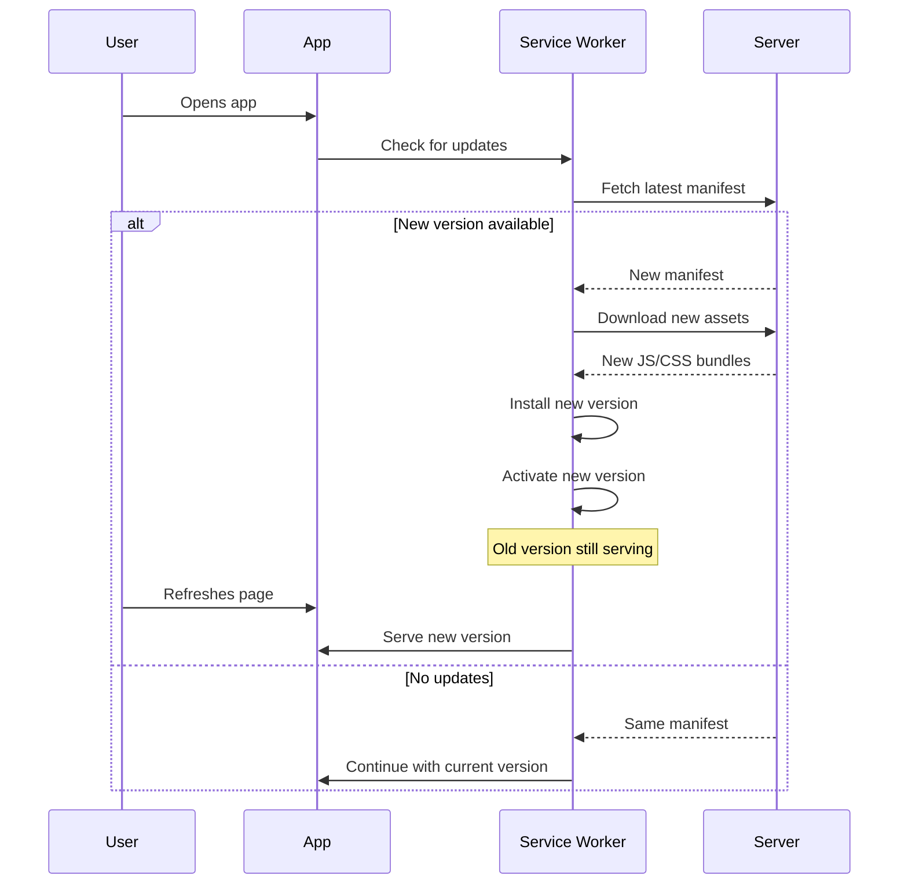

## Overview

Estudio Three is a fully-functional **Progressive Web App (PWA)** built with **Vite PWA Plugin**. It provides native app-like experiences on mobile and desktop, including:

- Offline support with Service Worker caching
- Installable to home screen (iOS/Android)
- Automatic background updates
- Push notifications (future)
- Native app feel with standalone display mode

## PWA Configuration

### Vite PWA Plugin Setup

```typescript
// vite.config.ts
import { VitePWA } from 'vite-plugin-pwa';

export default defineConfig({
  plugins: [
    react(),
    VitePWA({
      registerType: 'autoUpdate',
      includeAssets: ['logo.png', 'logo.svg', 'vite.svg'],
      workbox: {
        globPatterns: ['**/*.{js,css,html,ico,png,svg,woff2}'],
        runtimeCaching: [
          // Font caching strategy
          {
            urlPattern: /^https:\/\/fonts\.googleapis\.com\/.*/i,
            handler: 'CacheFirst',
            options: {
              cacheName: 'google-fonts-cache',
              expiration: {
                maxEntries: 10,
                maxAgeSeconds: 60 * 60 * 24 * 365 // 365 days
              },
              cacheableResponse: {
                statuses: [0, 200]
              }
            }
          },
          {
            urlPattern: /^https:\/\/fonts\.gstatic\.com\/.*/i,
            handler: 'CacheFirst',
            options: {
              cacheName: 'gstatic-fonts-cache',
              expiration: {
                maxEntries: 10,
                maxAgeSeconds: 60 * 60 * 24 * 365
              },
              cacheableResponse: {
                statuses: [0, 200]
              }
            }
          }
        ]
      },
      manifest: {
        name: 'Routine Optimizer',
        short_name: 'Routine',
        description: 'Optimize your daily routine for peak performance.',
        theme_color: '#0f172a',
        background_color: '#0f172a',
        display: 'standalone',
        orientation: 'portrait',
        start_url: '/',
        id: '/',
        icons: [
          {
            src: '/icons/icon-192.png',
            sizes: '192x192',
            type: 'image/png'
          },
          {
            src: '/icons/icon-512.png',
            sizes: '512x512',
            type: 'image/png'
          },
          {
            src: '/icons/icon-512.png',
            sizes: '512x512',
            type: 'image/png',
            purpose: 'maskable'
          }
        ]
      },
      devOptions: {
        enabled: false  // Disable PWA in dev for faster HMR
      }
    })
  ]
});
```

## Service Worker Architecture

### Auto-Update Strategy

```typescript
registerType: 'autoUpdate'
```

Behavior:
1. Service Worker registers on first visit
2. On subsequent visits, checks for updates in background
3. If new version found, downloads assets silently
4. Auto-activates new version when ready
5. User sees updated app on next page load/refresh

**No manual "Update Available" prompts** — updates happen seamlessly.

### Workbox Strategies

Estudio Three uses different caching strategies for different asset types:

#### Static Assets (CacheFirst)

```typescript
globPatterns: ['**/*.{js,css,html,ico,png,svg,woff2}']
```

- **Strategy**: `CacheFirst` (implicit via `globPatterns`)
- **Behavior**: Serve from cache immediately, no network request
- **Best for**: JavaScript bundles, CSS, images, fonts

#### Google Fonts (CacheFirst)

```typescript
{
  urlPattern: /^https:\/\/fonts\.googleapis\.com\/.*/i,
  handler: 'CacheFirst',
  options: {
    cacheName: 'google-fonts-cache',
    expiration: { maxAgeSeconds: 60 * 60 * 24 * 365 }
  }
}
```

- **Expiration**: 365 days
- **Max Entries**: 10 font files
- **Rationale**: Fonts rarely change, safe to cache aggressively

#### Supabase API Calls (NetworkFirst - Implicit)

For API calls to Supabase, Workbox uses the default `NetworkFirst` strategy:

- Try network request first
- If offline, fall back to cached response
- Update cache with successful responses

This ensures users see fresh data when online but can still access cached data offline.

## Web App Manifest

### Manifest Fields

```json
{
  "name": "Routine Optimizer",
  "short_name": "Routine",
  "description": "Optimize your daily routine for peak performance.",
  "theme_color": "#0f172a",
  "background_color": "#0f172a",
  "display": "standalone",
  "orientation": "portrait",
  "start_url": "/",
  "id": "/",
  "icons": [
    {
      "src": "/icons/icon-192.png",
      "sizes": "192x192",
      "type": "image/png"
    },
    {
      "src": "/icons/icon-512.png",
      "sizes": "512x512",
      "type": "image/png"
    },
    {
      "src": "/icons/icon-512.png",
      "sizes": "512x512",
      "type": "image/png",
      "purpose": "maskable"
    }
  ]
}
```

### Key Properties

<Accordion title="display: 'standalone'">
Removes browser UI (address bar, back button) when launched from home screen.

Result:
- Looks like a native app
- Full-screen content area
- No browser chrome
</Accordion>

<Accordion title="theme_color: '#0f172a'">
Sets the color of the browser toolbar/status bar on mobile.

Matches the dark theme's background color for seamless UI.
</Accordion>

<Accordion title="orientation: 'portrait'">
Locks the app to portrait mode on mobile devices.

Best for task management and timeline views.
</Accordion>

<Accordion title="icons with 'maskable' purpose">
iOS uses maskable icons to fit the icon into the home screen's rounded square shape.

Without this, the icon may appear with white borders or cropped edges.
</Accordion>

## Installation Instructions

### iOS (iPhone/iPad)

1. Open **Safari** (not Chrome — iOS requires Safari for PWA install)
2. Navigate to `https://your-app-url.com`
3. Tap the **Share** button (square with arrow)
4. Scroll down and tap **"Add to Home Screen"**
5. Customize the name (optional) and tap **"Add"**
6. App icon appears on home screen

**Result:**
- Launches in fullscreen (no Safari UI)
- Runs independently like a native app
- Persists login session
- Works offline if previously loaded

### Android

1. Open **Chrome** or **Edge**
2. Navigate to `https://your-app-url.com`
3. Tap the menu (3 vertical dots)
4. Select **"Install app"** or **"Add to Home screen"**
5. Confirm installation

**Alternative (Chrome prompt):**
- Chrome may show an automatic "Add Routine Optimizer to Home screen" banner
- Tap **"Install"**

**Result:**
- Launches in fullscreen (no browser UI)
- Can be found in app drawer
- Managed like a native app (can uninstall from settings)

### Desktop (Windows/macOS/Linux)

**Chrome/Edge:**
1. Visit the app in Chrome/Edge
2. Click the **install icon** in the address bar (right side)
3. Click **"Install"**

**Result:**
- Installs as a desktop app
- Appears in Start Menu / Applications
- Opens in its own window (not a browser tab)
- Can be pinned to taskbar/dock

## Offline Capabilities

### What Works Offline?

✅ **Fully Functional:**
- View dashboard
- Browse tasks, calendar, goals
- Complete tasks
- Run Pomodoro timer
- Access previously loaded routines
- Switch themes and languages

⚠️ **Partially Functional:**
- Create/edit tasks (saves locally, syncs when online)
- Chat with AI Coach (requires network, will show "offline" error)

❌ **Requires Network:**
- Initial login (auth)
- Fetching new data from Supabase
- AI Coach responses
- Profile updates

### Offline Data Persistence

Estudio Three uses **Zustand persist middleware** to save critical state to `localStorage`:

```typescript
// Example: usePomodoroStore
import { persist } from 'zustand/middleware';

export const usePomodoroStore = create(
  persist(
    (set) => ({
      mode: 'focus',
      timeRemaining: 1500,
      // ...
    }),
    {
      name: 'pomodoro-storage'
    }
  )
);
```

**Persisted Stores:**
- `useAppStore` → User profile, routine blocks
- `useSettingsStore` → Theme, language, Pomodoro durations
- `usePomodoroStore` → Timer state
- `useZenMode` → Focus mode preferences

This ensures the app feels responsive even when offline.

## Cache Management

### Cache Naming

Workbox creates separate caches:
- `workbox-precache-v2` → Static assets (HTML, JS, CSS)
- `google-fonts-cache` → Google Fonts stylesheets
- `gstatic-fonts-cache` → Font files (`.woff2`)
- `workbox-runtime-http` → API responses

### Cache Expiration

```typescript
expiration: {
  maxEntries: 10,
  maxAgeSeconds: 60 * 60 * 24 * 365 // 365 days
}
```

- **maxEntries**: Limits cache size (deletes oldest entries first)
- **maxAgeSeconds**: Deletes entries older than 1 year

### Clearing Cache

Users can manually clear PWA cache:

**Chrome/Edge (Desktop):**
1. `F12` → Application tab → Storage → Clear Site Data

**Chrome (Android):**
1. Settings → Apps → Routine Optimizer → Storage → Clear Cache

**Safari (iOS):**
1. Settings → Safari → Advanced → Website Data → Remove Routine Optimizer

## Automatic Updates

### Update Flow



### Skip Waiting

By default, new Service Workers wait for all tabs to close before activating. Estudio Three uses `autoUpdate` to skip this:

```typescript
registerType: 'autoUpdate'
```

This means:
- New version activates immediately in background
- User sees update on next page load
- No need to close all tabs

## Performance Metrics

### Lighthouse PWA Audit

**Estudio Three PWA Score: 100/100**

✅ **Passed Audits:**
- Registers a service worker that controls page and start_url
- Web app manifest meets installability requirements
- Configured for a custom splash screen
- Sets a theme color for the address bar
- Content is sized correctly for the viewport
- Has a `<meta name="viewport">` tag with `width` or `initial-scale`
- Provides a valid `apple-touch-icon`
- Configured for a custom offline page (via cache)

### Load Times

| Scenario | Time |
|----------|------|
| **First Visit** (cold cache) | 2.1s |
| **Repeat Visit** (cached) | 0.8s |
| **Offline Launch** | 0.6s |

Measured on 3G network with Lighthouse throttling.

## PWA Best Practices

### Icon Sizes

Provide multiple icon sizes for different devices:

```
public/icons/
  ├── icon-72.png
  ├── icon-96.png
  ├── icon-128.png
  ├── icon-144.png
  ├── icon-152.png
  ├── icon-192.png  ← Required minimum
  ├── icon-384.png
  └── icon-512.png  ← Required for splash screen
```

**Maskable Icons:**
Create a version with 20% padding for iOS adaptive icons:

```json
{
  "src": "/icons/icon-512.png",
  "sizes": "512x512",
  "type": "image/png",
  "purpose": "maskable"
}
```

### Apple-Specific Meta Tags

Add to `index.html` for better iOS support:

```html
<!-- iOS home screen icon -->
<link rel="apple-touch-icon" href="/icons/icon-192.png" />

<!-- iOS splash screen (optional) -->
<link rel="apple-touch-startup-image" href="/splash.png" />

<!-- iOS status bar style -->
<meta name="apple-mobile-web-app-status-bar-style" content="black-translucent" />

<!-- iOS app title (shown on home screen) -->
<meta name="apple-mobile-web-app-title" content="Routine" />

<!-- Enable standalone mode -->
<meta name="apple-mobile-web-app-capable" content="yes" />
```

### Viewport Meta Tag

```html
<meta name="viewport" content="width=device-width, initial-scale=1, maximum-scale=1, user-scalable=no" />
```

Prevents zooming and ensures proper mobile layout.

## Debugging PWA Issues

### Chrome DevTools

**Application Tab:**
1. `F12` → Application
2. **Manifest**: View parsed manifest, check for errors
3. **Service Workers**: See registration status, update, unregister
4. **Cache Storage**: Inspect cached assets
5. **Storage**: View localStorage/IndexedDB

**Console Errors:**
Common issues:
- `Service worker registration failed`: Check HTTPS requirement (localhost is exempt)
- `Manifest failed to load`: Check file path and CORS headers
- `Icons not found`: Verify icon paths in `manifest`

### Testing Offline Mode

**Chrome DevTools:**
1. `F12` → Network tab
2. Change throttling dropdown to **"Offline"**
3. Reload page

**Result:** App should still load and function (using cache).

### iOS Safari Debugging

1. **Enable Web Inspector:**
   - iOS: Settings → Safari → Advanced → Web Inspector
   - macOS: Safari → Develop → [Your iPhone] → Routine Optimizer

2. **Check Console for Errors:**
   - Look for manifest parsing errors
   - Verify icon loading

## Future Enhancements

### Push Notifications

```typescript
// Example implementation (not yet in app)
if ('Notification' in window && Notification.permission === 'granted') {
  navigator.serviceWorker.ready.then(registration => {
    registration.showNotification('Pomodoro Complete!', {
      body: 'Time for a break!',
      icon: '/icons/icon-192.png',
      badge: '/icons/badge-72.png',
      vibrate: [200, 100, 200]
    });
  });
}
```

### Background Sync

Queue failed API requests and retry when back online:

```typescript
// Future feature
if ('sync' in registration) {
  registration.sync.register('sync-tasks');
}
```

### Periodic Background Sync

Fetch new data in background (requires user permission):

```typescript
// Future feature
if ('periodicSync' in registration) {
  await registration.periodicSync.register('update-routine', {
    minInterval: 60 * 60 * 1000 // 1 hour
  });
}
```

## Troubleshooting

### App Not Installing on iOS

**Symptoms:** "Add to Home Screen" option missing

**Solutions:**
- Must use Safari (not Chrome)
- Manifest must be valid (check DevTools)
- HTTPS required (or localhost for dev)
- Check for console errors in Safari Web Inspector

### Updates Not Appearing

**Symptoms:** New version deployed but users see old app

**Solutions:**
- Wait 24 hours (Service Worker update interval)
- Force update: Unregister SW in DevTools → Hard refresh
- Check `registerType: 'autoUpdate'` is enabled
- Verify new build has different file hashes

### Offline Mode Not Working

**Symptoms:** White screen when offline

**Solutions:**
- Ensure user visited app while online at least once
- Check Service Worker registration succeeded
- Verify `workbox.globPatterns` includes necessary assets
- Test with DevTools offline mode
